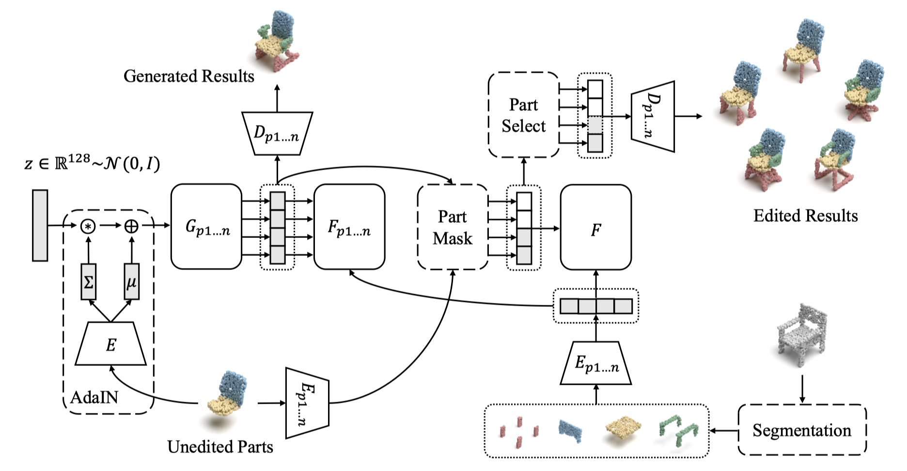

# Point Cloud Part Editing: Segmentation, Generation, Assembly, and Selection



This repository contains a PyTorch implementation of the paper:

[Point Cloud Part Editing: Segmentation, Generation, Assembly, and Selection](https://arxiv.org/abs/2312.11867)
<br>
[Kaiyi Zhang](https://scholar.google.com/citations?user=2F1aJh4AAAAJ&hl=zh-CN),
Yang Chen,
[Ximing Yang](https://symenyang.github.io/),
[Weizhong Zhang](https://weizhonz.github.io/),
[Cheng Jin](https://faculty.fudan.edu.cn/jc/zh_CN/index.htm)
<br>
AAAI 2024

## Introduction

Ideal part editing should guarantee the diversity of edited parts, the fidelity to the remaining parts, and the quality of the results. However, previous methods do not disentangle each part completely, which means the edited parts will affect the others, resulting in poor diversity and fidelity. In addition, some methods lack constraints between parts, which need manual selections of edited results to ensure quality. Therefore, we propose a four-stage process for point cloud part editing: Segmentation, Generation, Assembly, and Selection. Based on this process, we introduce SGAS, a model for part editing that employs two strategies: feature disentanglement and constraint. By independently fitting part-level feature distributions, we realize the feature disentanglement. By explicitly modeling the transformation from object-level distribution to part-level distributions, we realize the feature constraint. Considerable experiments on different datasets demonstrate the efficiency and effectiveness of SGAS on point cloud part editing. In addition, SGAS can be pruned to realize unsupervised part-aware point cloud generation and achieves state-of-the-art results.

## Dependencies

- Python 3.6
- CUDA 10.0
- G++ or GCC 7.5
- [PyTorch](https://pytorch.org/). Codes are tested with version 1.6.0
- (Optional) [Visdom](https://github.com/fossasia/visdom/) for visualization of the training process
- A single NVIDIA TITAN Xp

Install all the following tools based on CUDA.
```bash
# https://github.com/daerduoCarey/PyTorchEMD
cd utils/PyTorchEMD
python3 setup.py install

# https://github.com/stevenygd/PointFlow/tree/master/metrics
cd utils/metrics/pytorch_structural_losses
make
```

## Datasets

PartNet.v0.Merged dataset ([Google Drive](https://drive.google.com/file/d/1g8u5bkmfwg_-mPsVqnEvoI4XIOIC9CCN/view?usp=sharing)) modified from [PartNet](https://partnet.cs.stanford.edu/) dataset is used for point cloud part editing.

It merges some fine-grained semantic labels in each category of the PartNet dataset and removes some special objects. The details of the new dataset are listed as follows:

| Category | #Semantics | Train | Val | Test | All |
| :-: | :-: | :-: | :-: | :-: | :-: |
| Bag | 2 | 45 | 2 | 12 | 59 |
| Chair | 4 | 4343 | 599 | 1183 | 6125 |
| Display | 2 | 530 | 85 | 164 | 779 |
| Earphone | 2 | 127 | 23 | 46 | 196 |
| Faucet | 3 | 112 | 25 | 36 | 173 |
| Hat | 2 | 149 | 16 | 34 | 199 |
| Knife | 2 | 220 | 29 | 77 | 326 |
| Lamp | 3 | 521 | 81 | 133 | 735 |
| Laptop | 2 | 305 | 45 | 82 | 432 |
| Mug | 4 | 135 | 18 | 35 | 188 |
| Table | 2 | 4941 | 731 | 1440 | 7112 |

[ShapeNet-Partseg](https://cs.stanford.edu/~ericyi/project_page/part_annotation/) dataset is used for unsupervised part-aware point cloud generation. The whole data in each category without splitting is used for training.

Please download them to the `data` directory.

In addition, 6 real-world incomplete chairs and tables extracted from [ScanNet](http://www.scan-net.org/) dataset are used to prove the generalization ability of SGAS. The data is already in the `data` directory.

## Point Cloud Part Editing

All the core codes are under the `completion` directory. We provide four modes:  `train`, `test`, `metric`, and `realscan`. The corresponding config files can be found in the `configs` subdirectory. To run the code for one mode, you need to:

1. Copy the corresponding config file to the `completion` directory and rename it to `config.json`.
2. Add the required checkpoint path in the config file. Here we provide checkpoints for some pre-trained models ([Google Drive](https://drive.google.com/file/d/1QC-JkKWTJaNnUKcJdsOJhrX7zlpWn_rZ/view?usp=sharing)).
3. Modify the parameters in the config file if you want. For example, you can modify the value of parameter `vis` in the `config-test.json` file to `true`, then it will visualize the test results rather than saving them.
4. Use `python3 main.py` to run the code.

### Evaluation

After running mode `test`, you can use the evaluation code from [Multimodal-Shape-Completion](https://github.com/ChrisWu1997/Multimodal-Shape-Completion) to get the metrics `TMD` and `MMD`.

After running mode `metric` (it may take several hours in a single NVIDIA TITAN Xp), you will get a file `tmd_mmd.txt` in the `log` directory. Then you can run the `draw_tmds.py` under the `utils` directory to get our proposed new metric `TMDS`. Remember to set the `chair_path`, `lamp_path`, and `table_path` in the `draw_tmds.py` before running.

## Unsupervised Part-aware Point Cloud Generation

All the core codes are under the `generation` directory. We provide three modes:  `train`, `upartseg`, and `test`. The corresponding config files can be found in the `configs` subdirectory. To run the code for one mode, you need to:

1. Copy the corresponding config file to the `generation` directory and rename it to `config.json`.
2. Add the required checkpoint path in the config file. Here we provide checkpoints for some pre-trained models ([Google Drive](https://drive.google.com/file/d/104sD0tea6PBLhXcktp6rdfJ5h3agSv6Y/view?usp=sharing)).
3. Modify the parameters in the config file if you want. For example, you can modify the value of parameter `vis` in the `config-test.json` file to `true`, then it will visualize the test results rather than calculate the metrics.
4. Use `python3 main.py` to run the code.

You must follow the order of `struct_gen` training, `upartseg`, `part_ae` training, `part_gen` training, and `test` to run each mode. `struct_gen` training and `upartseg` are used to get part Ground Truth. Some related codes are taken from [AXform](https://github.com/kaiyizhang/AXform).

### Evaluation

You can run mode `test` to get the metrics `JSD`, `MMD-CD/EMD`, and `COV-CD/EMD`. The evaluation code is modified from [latent_3d_point](https://github.com/optas/latent_3d_points) with the parameter [setting](https://github.com/optas/latent_3d_points/blob/master/notebooks/compute_evaluation_metrics.ipynb).

## Visualization

[Mitsuba 3](https://www.mitsuba-renderer.org/) is used for the visualization of results in the paper. An example code can be found in [Point Cloud Renderer](https://github.com/zekunhao1995/PointFlowRenderer/).

## Citation

Please cite our work if you find it useful:
```latex
@article{zhang2021attention,
  title={Point Cloud Part Editing: Segmentation, Generation, Assembly, and Selection},
  author={Zhang, Kaiyi and Chen, Yang and Yang, Ximing and Zhang, Weizhong and Jin, Cheng},
  journal={arXiv preprint arXiv:2312.11867},
  year={2023}
}
```

## License

This project Code is released under the MIT License (refer to the LICENSE file for details).